# Linux Base
## Part 1. Установка ОС

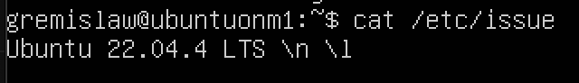

Версия Ubuntu, команда cat /etc/issue.

## Part 2. Создание пользователя

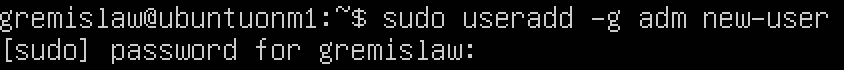

Команда для создания пользователя в группе adm.

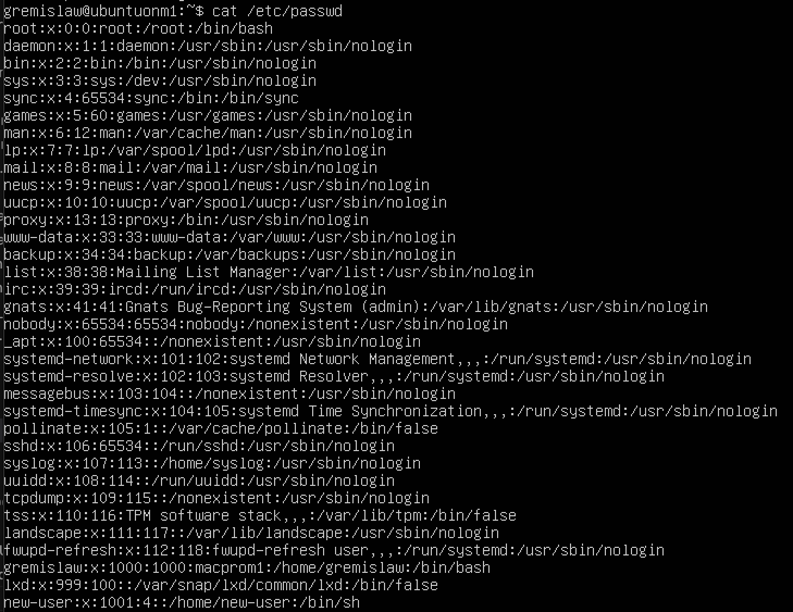

Результат работы команды cat /etc/passwd.

## Part 3. Настройка сети ОС

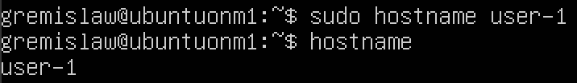

Команда для изменение названия машины. Измененное название машины.

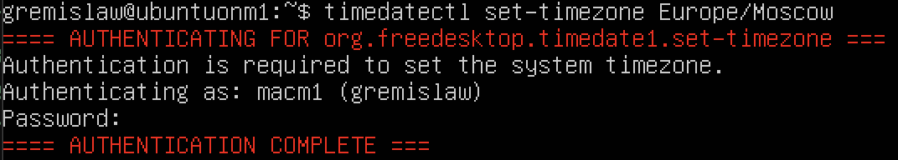

Изменение временной зоны на текущую.

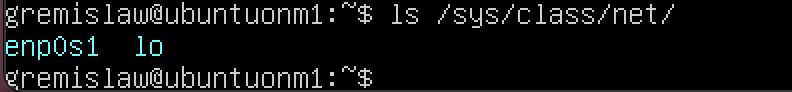

Вывод списка сетевых интерфейсов.

Интерфейс lo:
lo означает "loopback" (петля).
Этот интерфейс используется для локального (на уровне операционной системы) тестирования сетевой стеки.
Пакеты, отправленные на lo, не покидают компьютер и не направляются в сеть. Они циркулируют локально внутри самого устройства.
Используется для проверки сетевого стека и функционирования сетевых приложений без реальной сети.

Установка набора сетевых инструментов

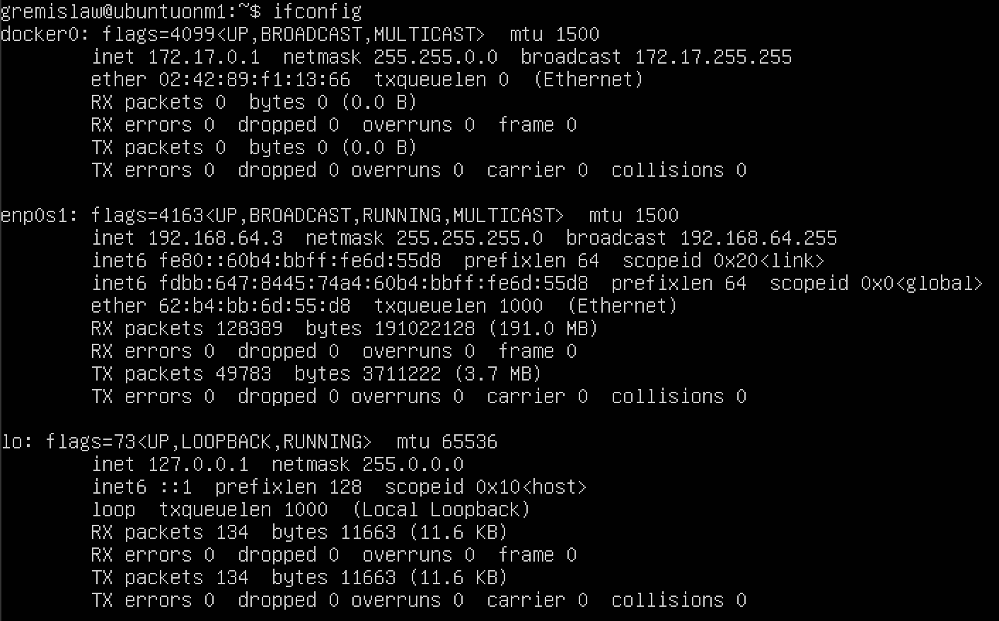

Получение ip адреса.

Dynamic Host Configuration Protocol (DHCP):
  - DHCP - это протокол автоматической конфигурации сети.
  - Процесс:
    1. Запрос (Discover): Устройство отправляет запрос в сеть, ища доступные DHCP-серверы.
    2. Предложение (Offer): DHCP-сервер предлагает IP-адрес и другие настройки клиенту.
    3. Запрос (Request): Клиент выбирает предложенные настройки и отправляет запрос для подтверждения.
    4. Подтверждение (Acknowledge): DHCP-сервер подтверждает использование настроек.

DHCP обеспечивает автоматическую конфигурацию сети, делая процесс подключения устройств к сети более удобным и эффективным.

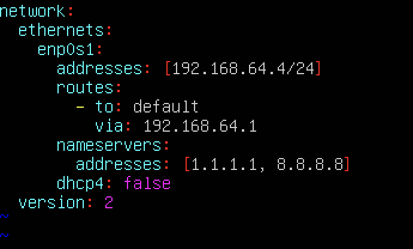

Статичная настройка ip, gw, dns. Изменение конфигурации DHCP. 

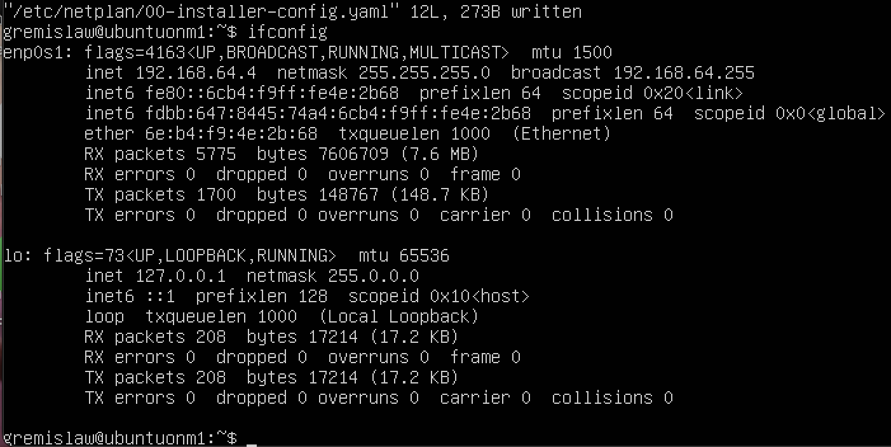

Вывод команды подтверждающей изменение данных

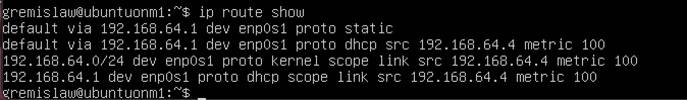

подтверждение того что данные заданы статично 

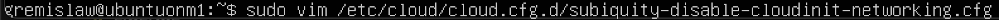

Изменение конфигурации сетевого интерфейса

Этапы изменения данных :
1. Отключение облачной инициализации протокола DHCP 
2. Перезапуск машины
3. Изменить конфигурацию сетевого интерфейса 

Для этого необходимо открыть файл конфигурации `subiquity-disable-cloudinit-networking.cfg` в каталоге `/etc/cloud/cloud.cfg.d/`   и  установить  «network» в положение «disabled«. Это можно сделать прописав sudo netplan apply в терминале.

Затем перейти к файлу конфигурации "Netplan" `/etc/netplan/00-installer-config.yaml`.

Чтобы назначить статический IP-адрес интерфейсу, необходимо изменить файл следующим образом, изменить значение "`dhcp4`" `на` `"false"`  а так же добавить статический IP адрес сервера в разделе `"addresses"`.
Далее нам необходимо указать шлюз(gw) и DNS..

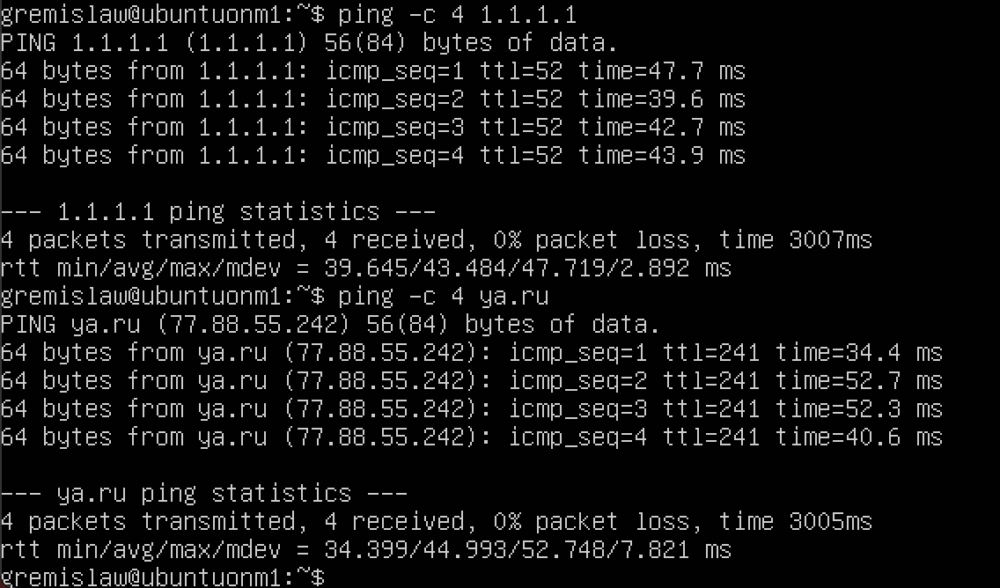

Пинг удаленных хостов 1.1.1.1 и ya.ru

## Part 4. Обновление ОС

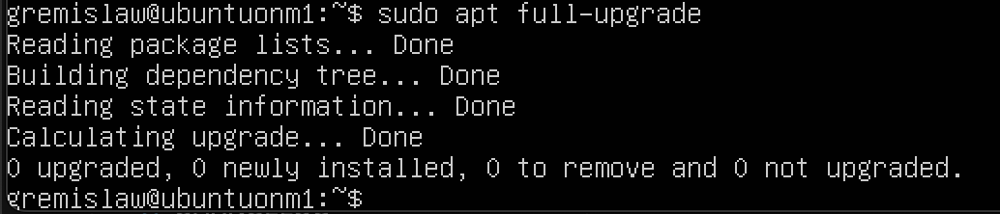

Подтверждение отсутствия необходимости обновления.

## Part 5. Использование команды **sudo**

предоставление прав sudo пользователю из Part 2.

Измененный hostname

 Команда **sudo** ( **s**ubstitute **u**ser and **do**, подменить пользователя и выполнить ) позволяет строго определенным пользователям выполнять указанные программы с административными привилегиями без ввода пароля суперпользователя **root**.

## Part 6. Установка и настройка службы времени

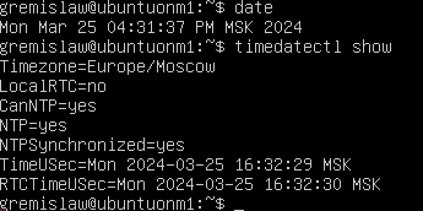

Вывод команды с корректным временем.

## Part 7. Установка и использование текстовых редакторов

Создание файла VIM с сохранением изменений (:wq)

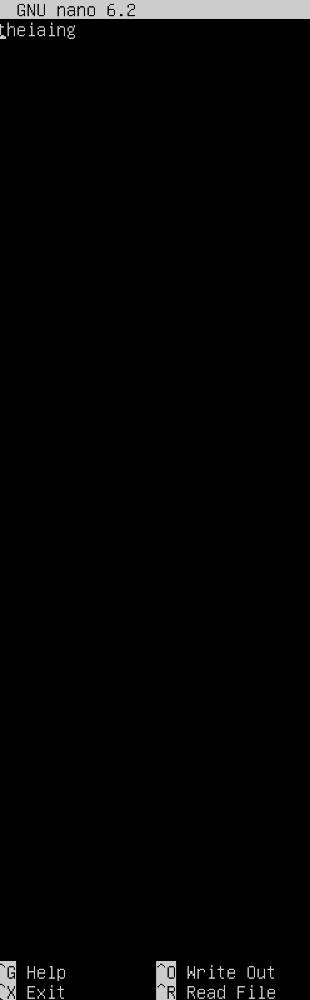

Создание файла в nano c сохранением изменений(CTRL + X).

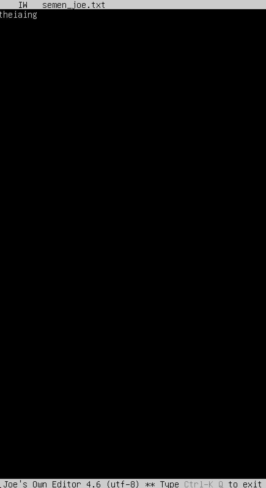

Создание файла в joe  с сохранением изменений(CTRL+K+X).

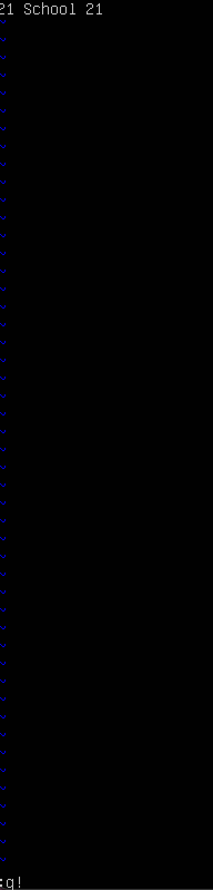

Редактирование файла в VIM без сохранения изменений (:q!)

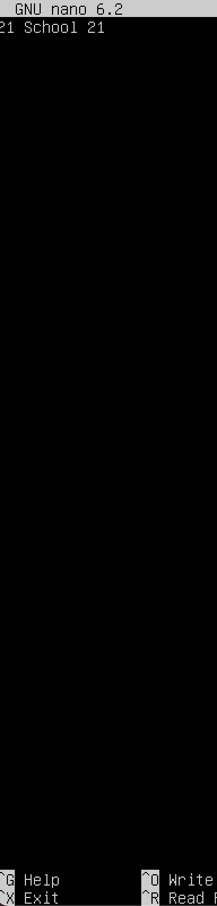

Редактирование файла в nano без сохранения изменений (CTRL + X, N)

Редактирование файла в joe без сохранения изменений (CTRL + C, Y)

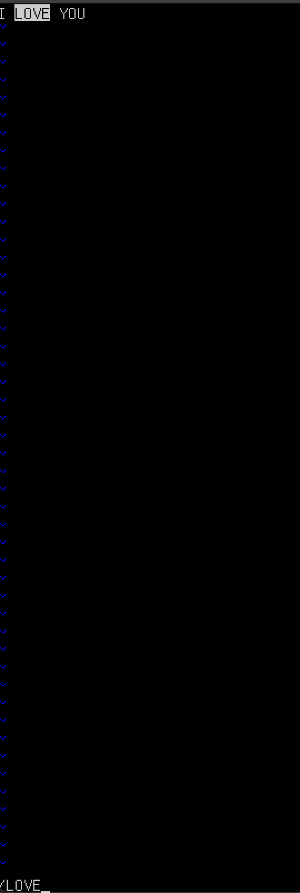

Результат поиска слова VIM (/).

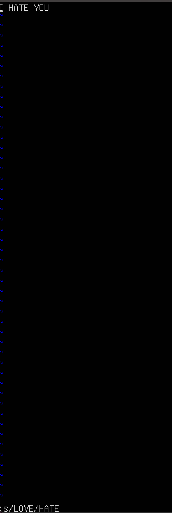

Команда для замены слова VIM.

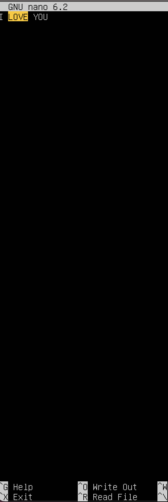

Поиск слова в nano (Ctrn + /)

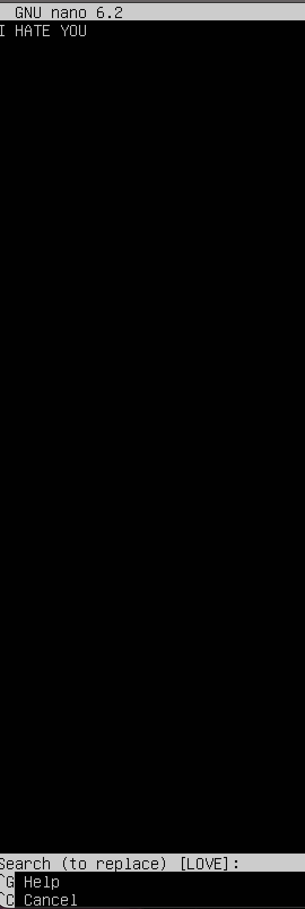

Поиск и замена слова в nano (Ctrn + / + enter + enter).

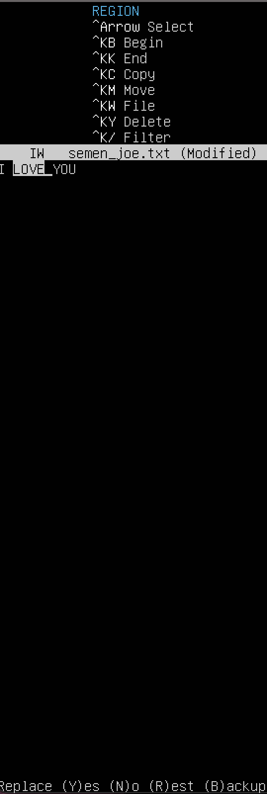

Поиск слова в joe.

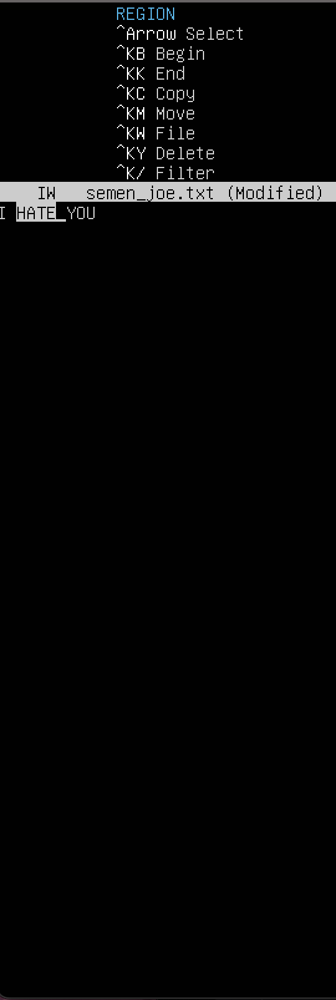

поиск и замена слова в Joe.

## Part 8. Установка и базовая настройка сервиса **SSHD**

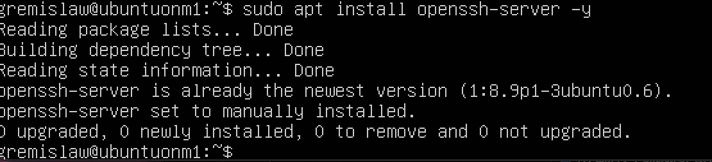

команда для устаnoвки ssh server и ее результат.

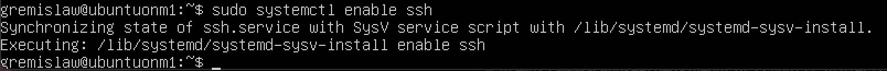

команда для автозапуска службы и ее вывод.

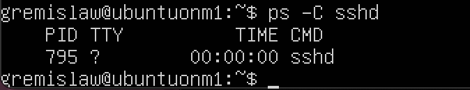

Наличие процесса 

ps - это команда, которая выводит список текущих процессов на вашем сервере в виде таблицы, с которой можно удобно работать: сортировать, изменять количество колонок и прочие. У утилиты ps множество настроек, с помощью которых можно тонко настраивать вывод команды, также никто не запрещает вам делать конвейеры, чтобы отсечь всё лишнее.  

- A, -e, (a) - выбрать все процессы;  

- -a - выбрать все процессы, кроме фоновых;  

- -d, (g) - выбрать все процессы, даже фоновые, кроме процессов сессий;  

- -N - выбрать все процессы кроме указанных;  

- -С - выбирать процессы по имени команды;  

- -G - выбрать процессы по ID группы;  

- -p, (p) - выбрать процессы PID;  

- --ppid - выбрать процессы по PID родительского процесса;  

- -s - выбрать процессы по ID сессии;  

- -t, (t) - выбрать процессы по tty;  

- -u, (U) - выбрать процессы пользователя.

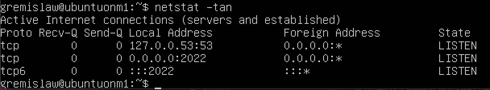

Вывод команды (netstat -tan) и изменённый порт.

**Флаги:**
* -t (--tcp) - Отображение текущего подключения в состоянии переноса нагрузки с процессора на сетевой адаптер при передаче данных ( "offload" )
* -a (--all) - Отображение всех подключений и ожидающих портов
* -n (--numeric) - Отображение адресов и номеров портов в числовом формате

 Proto - протокол, используемый сокетом (программной интерфейс для обеспечения обмена данными между процессами). Так как была использована опция [-t|--tcp], в выводе присутствуют только TCP-сокеты.

* Recv-Q - счётчик байт, не скопированных программой пользователя из этого сокета.

* Send-Q - счётчик байтов, не подтверждённых удалённым узлом.

* Local Address - адрес и номер порта локального конца сокета. Если указана опция [-n|--numeric], вывод в формате [адрес сокета:номер порта], иначе - [каноническое имя узла:соответствующее имя службы].

0.0.0.0 - адрес локального конца сокета, 2022 - номер порта, который мы поменяли с 22 на 2022. Адрес 0.0.0.0 означает, что удаленный конец сокета будет доступен всем локальным ip-адресам.

* Foreign Address - адрес и номер порта удалённого конца сокета.

* State - состояние сокета. Состояние LISTEN означает, что сокет ожидает входящих подключений

## Part 9. Установка и использование утилит **top**, **htop**

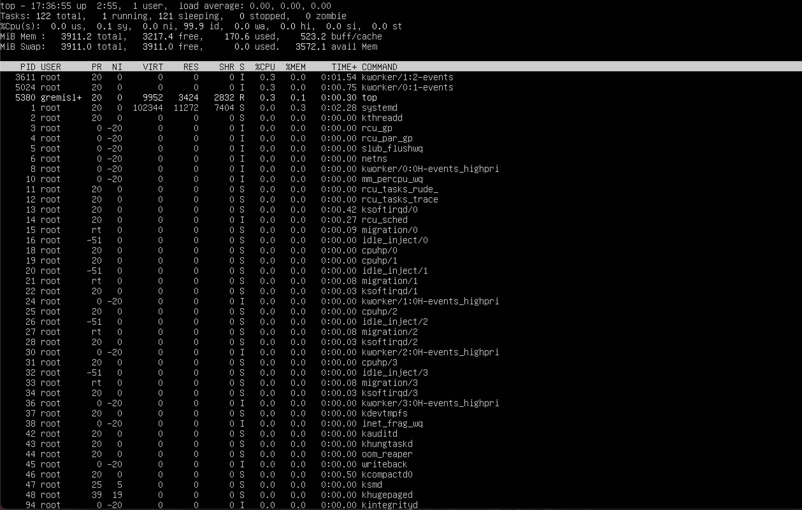

  - uptime 2:50

  - количество авторизованных пользователей 1

  - общую загрузку системы 0.00

  - общее количество процессов 122

  - загрузку cpu 0.0

  - загрузку памяти 3911.2 

  - pid процесса занимающего больше всего памяти 690(сортировка по памяти `Shift+M`)

  - pid процесса, занимающего больше всего процессорного времени 5380(команда top)

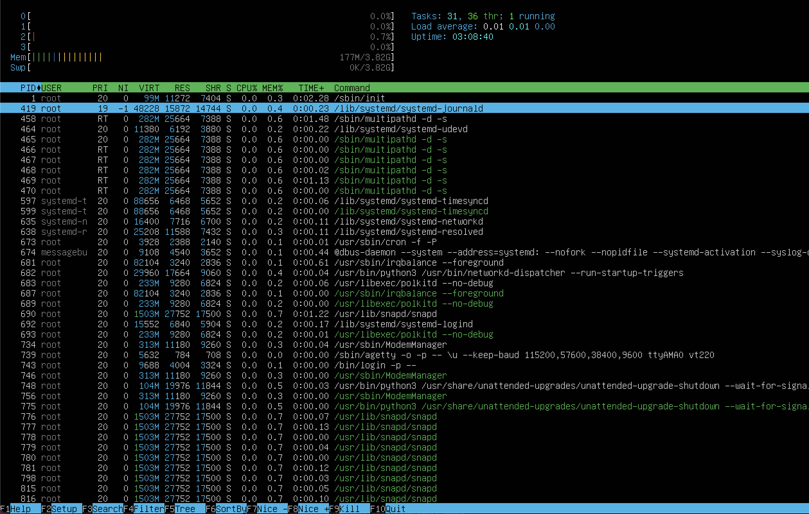
	 Сортировка по PID

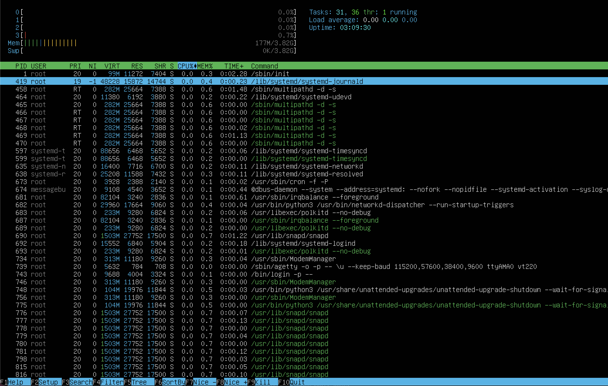
	 Сортировка по PERCENT_CPU

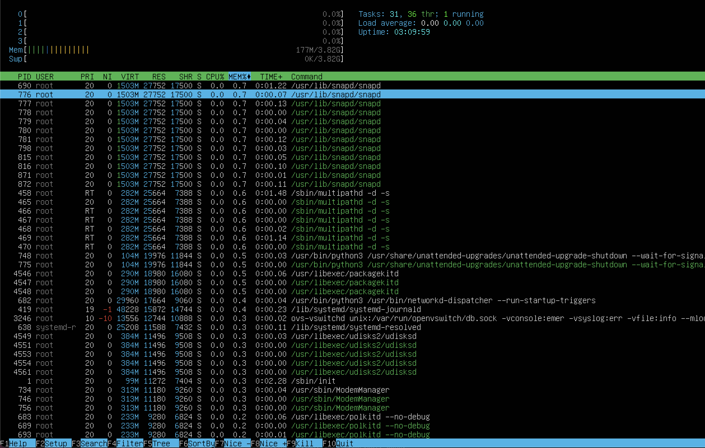
	 Сортировка по PERCENT_MEM

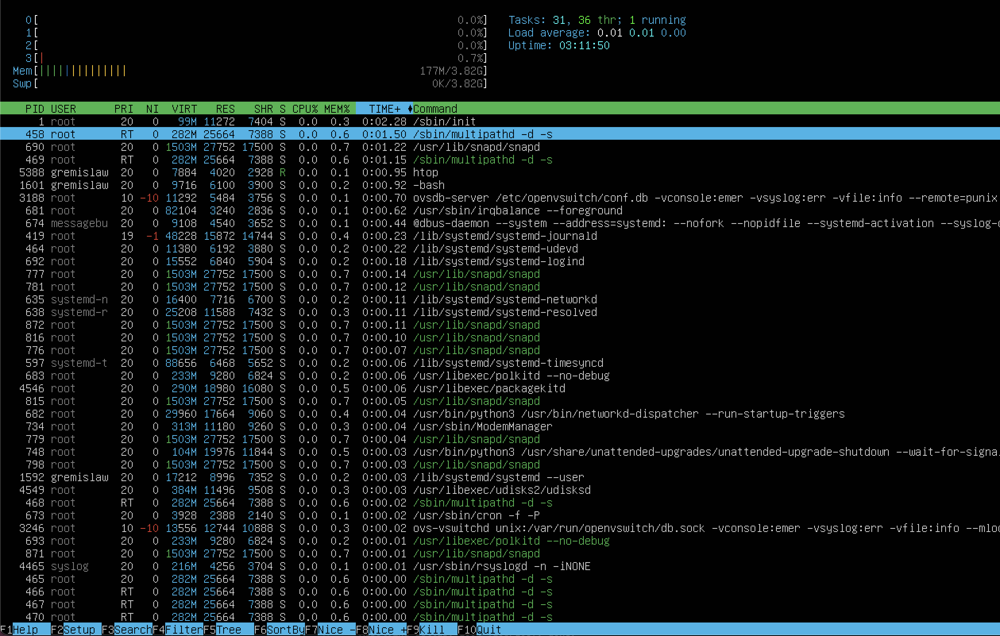
	 Сортировка по TIME

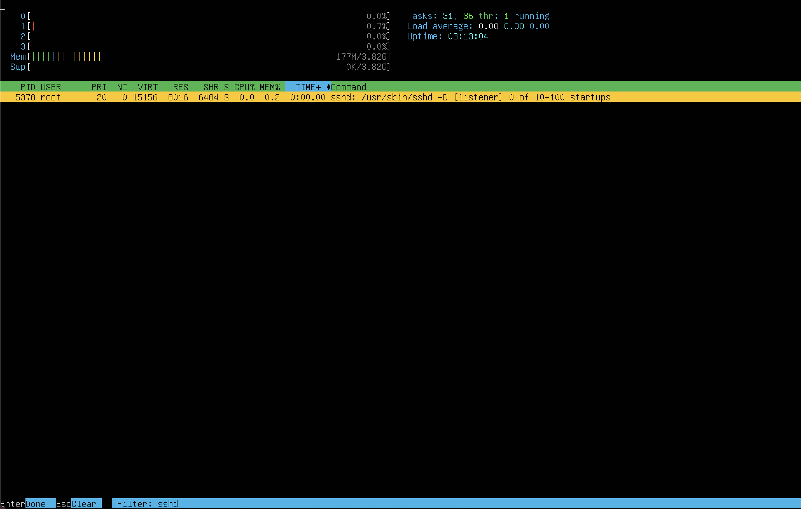
	Фильтр по процессу SSHD

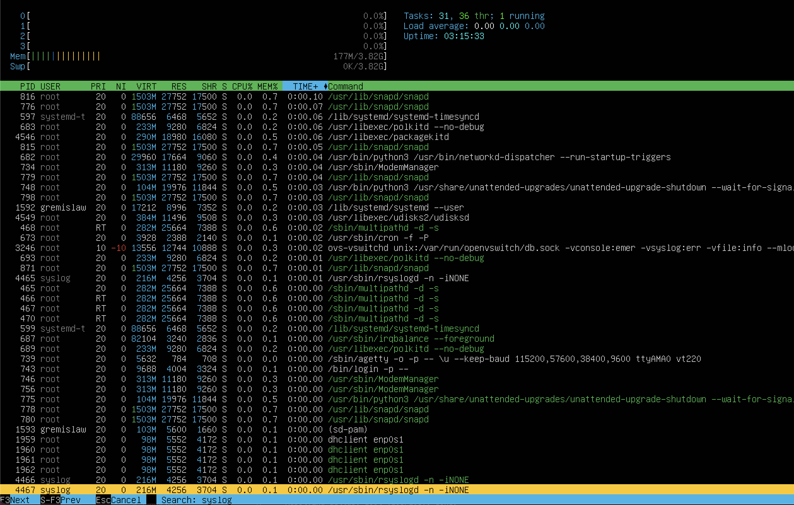
	Фильтр по процессу syslog через поиск

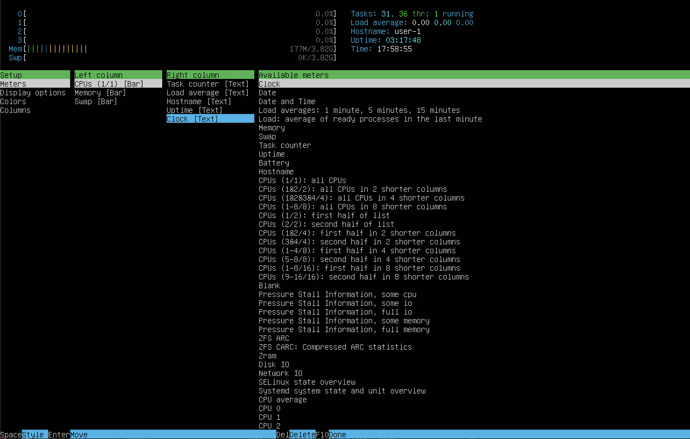
	Вывод с добавлением  hostname, clock и uptime

## Part 10. Использование утилиты **fdisk**

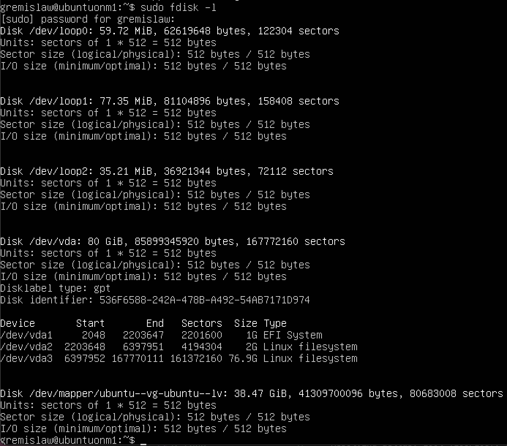

Вывод команды fdisk.

- Название диска : /dev/mapper
- Размер : 38,47 Гигабайт 
- Cекторов : 80683008
- swap: 0B total, 0B used

## Part 11. Использование утилиты **df**

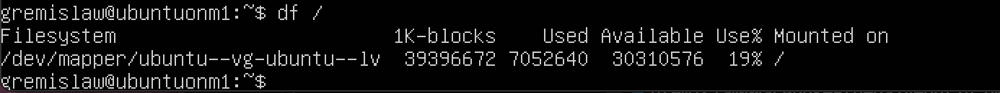

Запуск команды df.

- размер раздела 39396672
- размер занятого пространства 7052640
- размер свободного пространства 30310576 
- процент использования 19%
- единицу измерения в выводе (килобайт)

Запуск команды df -Th.

- размер раздела 38Гб
- размер занятого пространства 6.8Г
- размер свободного пространства 29Г
- процент использования 19%
- тип файловой системы ext4

## Part 12. Использование утилиты **du**

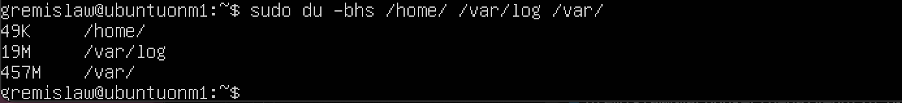

Вывод размера папок /home, /var, /var/log

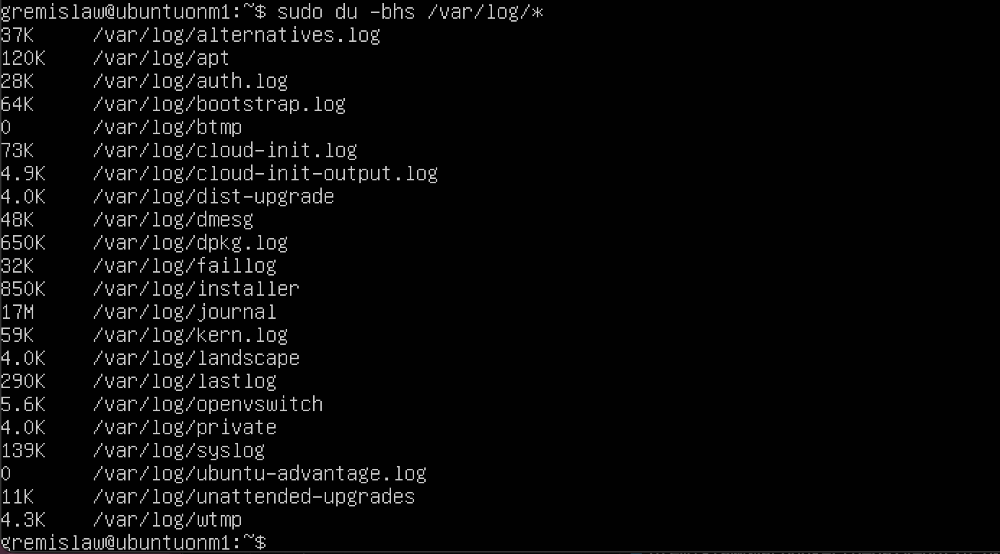

Вывод всего содержимого используя (*).

 -Используемые флаги:

- -b : указать единицы вывода размера, доступно: K,M,G,T,P,E,Z,Y для 1024 и KB, MB и так далее для 1000; 

- -h : выводить размер в единицах измерения удобных для человека;

- -s : выводить только общий размер;

## Part 13. Установка и использование утилиты **ncdu**

Вывод папок /home, /var, /var/log с помощью утилиты ncdu

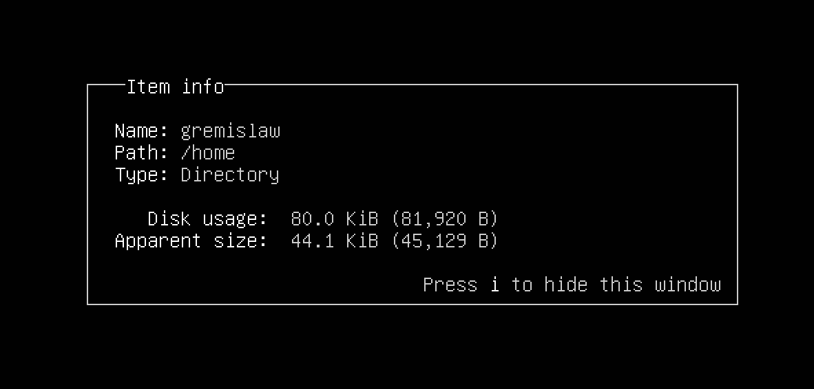

Папка /home

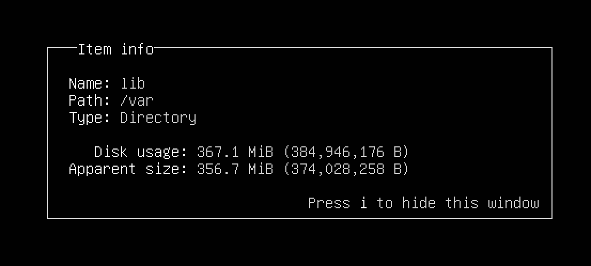

Папка /log

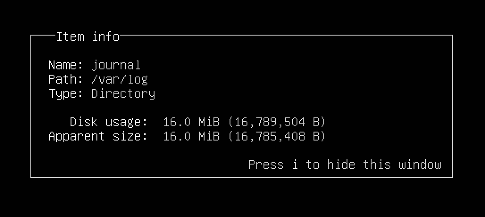

Папка var/log

## Part 14. Работа с системными журналами

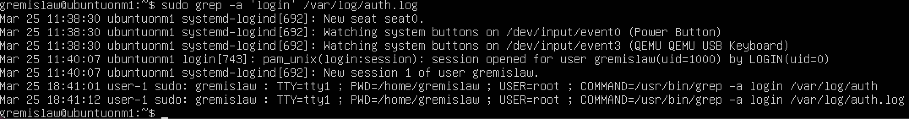

вывод время последней успешной авторизации, имя пользователя и метод входа в систему.

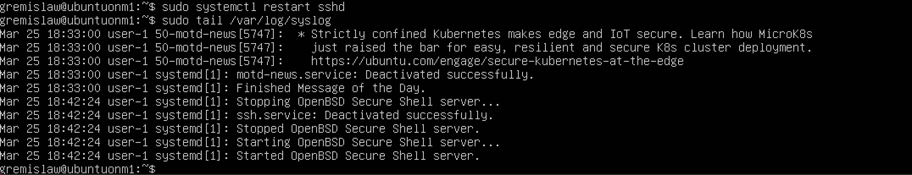

Перезапуск службу SSHd.

## Part 15. Использование планировщика заданий **CRON**

Используя планировщик заданий, запусти команду uptime через каждые 2 минуты.

1. используем команду `crontab -e`
2. выбираем редактор из предложенных
3. прописываем строку `*/2 * * * * uptime | wall` 
 ( она говорит, что надо запускать  скрипт каждые 2 минуты)

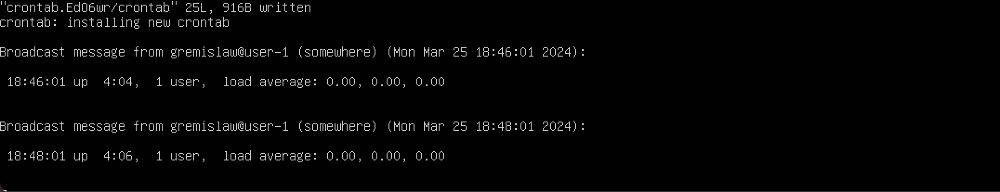

Вывод  команды uptime  каждые две минуты.

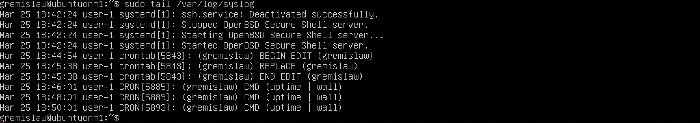

Существование процесса в журнале

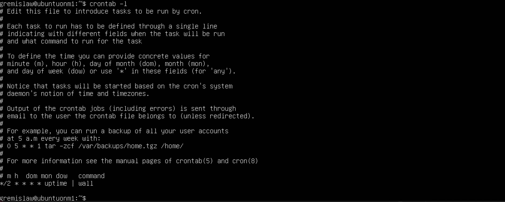

Список текущих задач для CRON

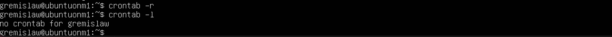

Удаление записей и проверка отсутствия.

